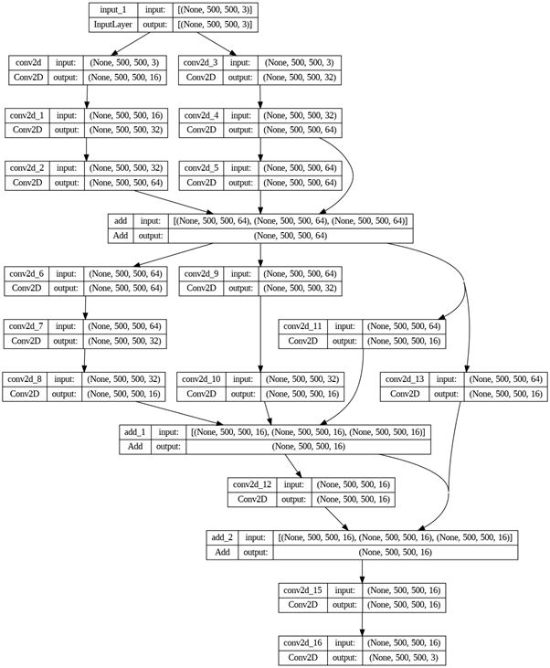
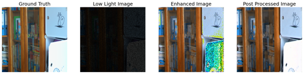

# Low-Light Image Enhancement Using CNNs

### Prerequisites
Ensure that the following dependencies are installed:
- Python 3.x
- TensorFlow
- OpenCV
- NumPy
- Matplotlib

## Overview

This project presents a solution for enhancing low-light images using a custom Convolutional Neural Network (CNN) architecture. The model not only improves the brightness and clarity of low-light images but also incorporates noise reduction and post-processing techniques to achieve high-quality outputs.

The approach combines deep learning techniques with traditional image processing methods to provide a robust enhancement pipeline for images captured in poor lighting conditions. 

## Dataset

We use the [LOL (Low-Light) dataset](https://daooshee.github.io/BMVC2018website/), which contains paired low-light and normal-light images. The dataset structure includes:
- `our485`: Training images with paired low-light and normal-light images.
- `eval15`: Evaluation images for testing model performance.

## Features

### 1. Custom CNN Architecture
The network is designed to handle the specific challenges of low-light image enhancement. It consists of multiple convolutional layers. This helps the model learn and preserve essential image details while enhancing brightness.

### 2. Image Preprocessing
The input images are preprocessed to simulate low-light conditions by darkening and adding noise. This helps in improving the model’s robustness when processing real-world low-light images.

### 3. Post-Processing Techniques
To further refine the enhanced images, we apply several post-processing techniques:
- **Noise Reduction**: Reduces noise using OpenCV's `fastNlMeansDenoisingColored`.
- **Color Correction**: Adjusts color saturation and brightness using the HSV color space.
- **Sharpening**: Enhances edge details to make the image clearer and more defined.

## Model Architecture

The custom CNN is designed with multiple convolutional layers and ReLU activations.This architecture captures fine details and enhances low-light images while maintaining high resolution and minimizing artifacts.
Model architecture is as below:



## Preprocessing Pipeline

Low-light images are artificially generated by darkening and adding noise to high-light images from the dataset. Here's the code snippet for preprocessing:

```python
def PreProcessData(ImagePath):
    # Load high-light images, darken them and add noise
    return X_, y_
```

## Post-Processing

After the model enhances the images, additional refinement is applied:
- **Denoising**: Using `fastNlMeansDenoisingColored` to smooth out noise.
- **Sharpening**: Applying a custom sharpening kernel to enhance edges.
- **Color Correction**: Correcting color imbalances in the HSV color space.

```python
def combined_post_processing(image):
    post processing steps like denoising, sharpeninf, color correction
    return image
```

## Results

The model produces enhanced images from low-light inputs, with visible improvements in brightness, clarity, and noise reduction. The post-processing pipeline further polishes the output, making the images closer to real-world high-light quality.
Below is a comparison of the Ground Truth, Low Light Image, Enhanced Image, and Post-Processed Image:



